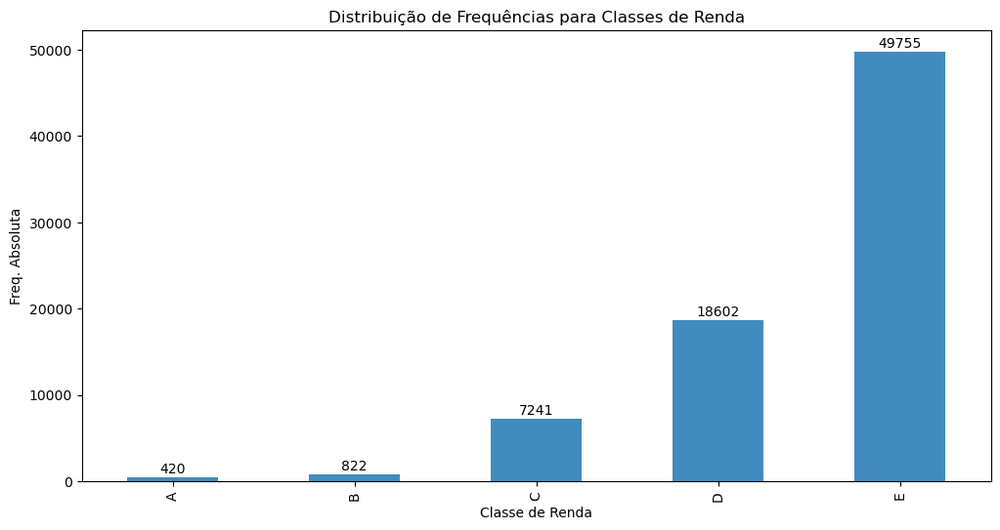
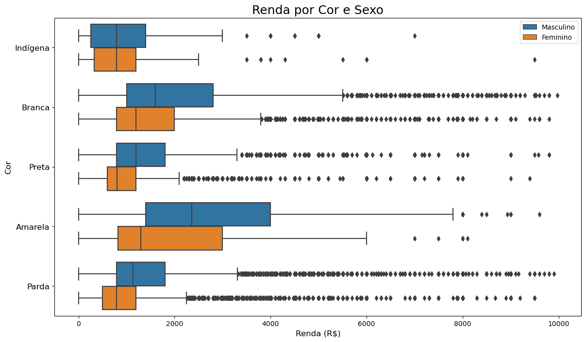
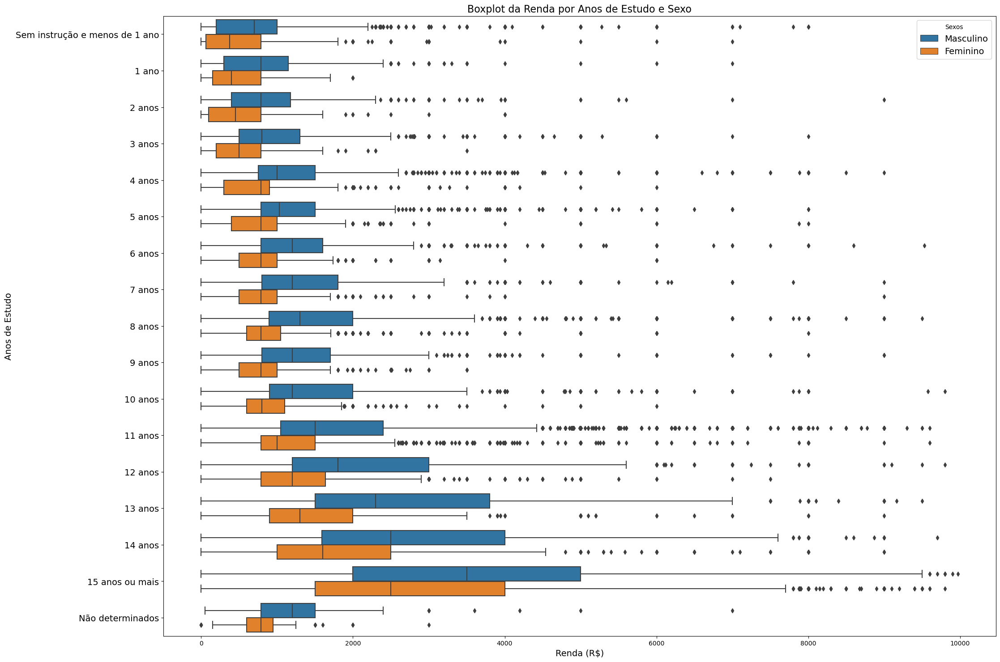
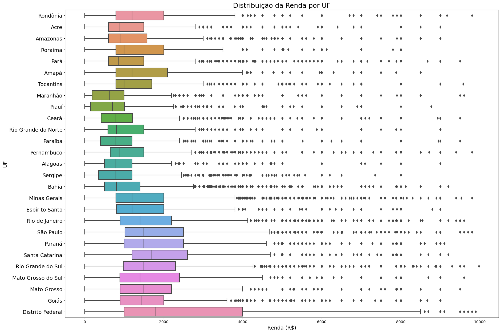

# Análise Descritiva de Dados da PNAD 2015

## Contextualização

A partir de um conjunto de dados já tratados da Pesquisa Nacional de Amostra de Domicílios (PNAD) de 2015, realizamos uma Análise Descritiva dos dados. O referido conjunto de dados é formado por 76.840 registros e 7 colunas.

Inicialmente, realizamos uma análise do comportamento da variável `Renda`, construindo uma tabela de distribuição de frequências absolutas e relativas para cada uma das classes de renda e construímos o gráfico a seguir:



Em seguida, construímos uma tabela de contingência de frequências para contabilizar o número de entrevistados por sexo e cor da pele.

Calculamos as medidas de tendência central da variável `Renda` e as medidas de dispersão. Elaboramos duas tabelas com o cruzamento das variáveis `Sexo` e `Cor` a fim de analisar o comportamento da variável `Renda` para diferentes formas de agregação (valores médios, medianos, máximos e de dispersão).

Ainda analisando a variável `Renda` segundo `Sexo` e `Cor`, construímos um diagrama de caixa (boxplot) para visualizarmos a distribuição desta variável:



Analisamos os percentis da variável renda e descobrimos que 28% dos entrevistados recebiam até 1 (um) salário mínimo, que na época era de R$788,00.

Ao analisar a renda por anos de estudo, verificamos que, no geral, as pessoas com mais anos de estudo ganhavam mais, conforme este boxplot:



Por fim, realizamos uma análise da distribuição da renda por Unidades da Federação (UFs), o que nos permitiu construir o seguinte boxplot:



## Créditos

Este projeto foi desenvolvido como principal atividade do Curso [Estatística com Python: frequências e medidas](https://cursos.alura.com.br/course/estatistica-distribuicoes-e-medidas) da [Formação de Data Science](https://cursos.alura.com.br/formacao-data-science) da [Alura](https://www.alura.com.br/), o qual foi ministrado pelo instrutor Rodrigo Fernando Dias.

## Reproduza este Projeto em sua Máquina

Abra o terminal e digite o seguinte comando para clonar este repositório:

```bash
git clone https://github.com/diego-torres-coder/Analise-Descritiva-de-Dados.git
```

Navegue até a pasta do projeto:

```bash
cd Analise-Descritiva-de-Dados/
```

Crie um ambiente conda para o projeto, digitando o seguinte comando no terminal:

```bash
conda create -n statistics python=3.10
```

Ative o ambiente virtual:

```bash
conda activate statistics
```

Instale as dependências do projeto:

```bash
pip3 install numpy pandas openpyxl scipy seaborn jupyterlab
```

Em vez de instalar as dependências usando o comando acima, você pode usar o arquivo `requirements.txt` disponível neste repositório. Para isso, digite o seguinte comando em seu terminal:

```bash
pip3 install -r requirements.txt
```
Abra o projeto no Jupyter Lab:

```bash
jupyter-lab
```

Por fim, execute todas as células do notebook.
